# Technology Architecture & Design: SkillMill

**Document status:** Draft v0.1
**Last updated:** 2026-03-03

---

## 1. Overview

This document describes the technical architecture of the SkillMill system. The system is structured as a Rust workspace composed of a core library, discipline plugins, a CLI tool, and a web server.

```
┌─────────────────────────────────────────────────────────┐
│                   skillmill-server                       │
│             REST API · Auth · Mastery DB                 │
├─────────────────────────────────────────────────────────┤
│                   skillmill-cli                          │
│          Local generation · Batch · Preview              │
├─────────────────────────────────────────────────────────┤
│                   skillmill-core                         │
│   Curriculum Graph · Schema Engine · Composer · Render   │
├────────────────────────────────────────────────────────┤
│  skillmill-math │ skillmill-english │ skillmill-french  │
│               Discipline Plugins                         │
└─────────────────────────────────────────────────────────┘
```

---

## 2. Repository Layout

The project is a single Rust Cargo workspace.

```
skillmill/
├── Cargo.toml                  # workspace root
├── crates/
│   ├── skillmill-core/         # core library (libskillmill)
│   ├── skillmill-cli/          # CLI binary
│   └── skillmill-server/       # web server binary
├── plugins/
│   ├── skillmill-math/         # Singapore Math plugin
│   ├── skillmill-english/      # English grammar & vocabulary plugin
│   └── skillmill-french/       # French (DELF) plugin
├── templates/
│   ├── base/                   # shared Typst templates
│   └── disciplines/            # per-discipline Typst overrides
│       ├── math/
│       ├── english/
│       └── french/
├── curricula/
│   ├── math-singapore/         # YAML curriculum graphs
│   ├── english-cambridge/
│   └── french-delf/
└── docs/
    └── specs/
```

---

## 3. Component Architecture

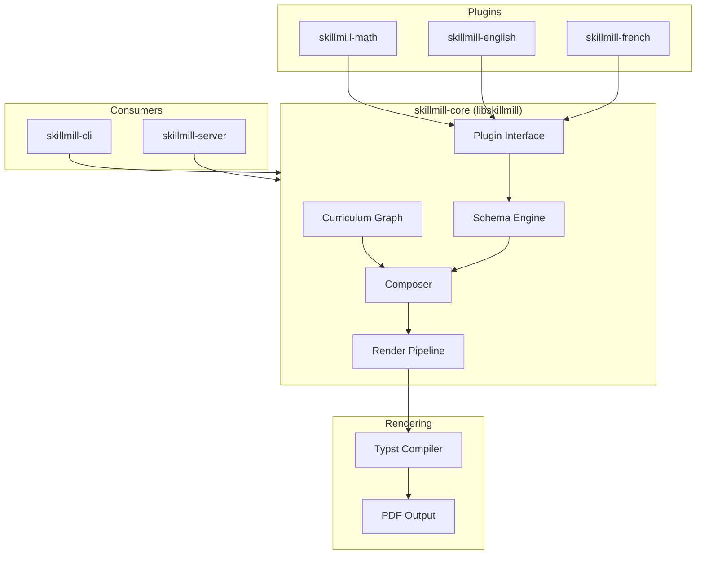

---

## 4. Core Library: `skillmill-core`

### 4.1 Module Structure

```
skillmill-core/
└── src/
    ├── lib.rs
    ├── curriculum/     # graph model, node types, prerequisite resolution
    ├── schema/         # schema execution, variable sampling, constraint solving
    ├── compose/        # worksheet composition from policies and student profiles
    ├── render/         # Typst template injection and PDF compilation
    └── plugin/         # DisciplinePlugin trait and registry
```

### 4.2 Core Data Types

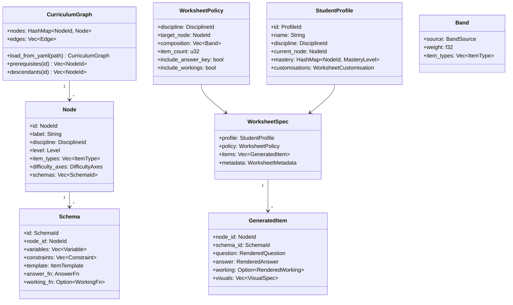

### 4.3 Plugin Interface

Every discipline is a Rust crate that implements the `DisciplinePlugin` trait. The core engine knows nothing about any specific subject — all domain knowledge lives in plugins.

```rust
/// Implemented by each discipline crate and registered at startup.
pub trait DisciplinePlugin: Send + Sync {
    /// Unique identifier, e.g. "math-singapore", "english-cambridge".
    fn id(&self) -> &'static str;

    /// Human-readable name.
    fn name(&self) -> &'static str;

    /// Return the curriculum graph for this discipline.
    fn curriculum(&self) -> &CurriculumGraph;

    /// Execute a schema: sample variables, apply constraints,
    /// return a fully resolved GeneratedItem.
    fn execute_schema(
        &self,
        schema_id: &SchemaId,
        rng: &mut dyn RngCore,
        difficulty: &DifficultyAxes,
    ) -> Result<GeneratedItem, SchemaError>;

    /// Validate a generated answer (used in CI).
    fn validate_answer(&self, item: &GeneratedItem) -> ValidationResult;

    /// Path to this discipline's Typst template directory.
    fn template_dir(&self) -> &Path;
}
```

Plugins are registered with a central `PluginRegistry` at binary startup:

```rust
let mut registry = PluginRegistry::new();
registry.register(skillmill_math::MathPlugin::new());
registry.register(skillmill_english::EnglishPlugin::new());
```

### 4.4 Worksheet Composition Pipeline

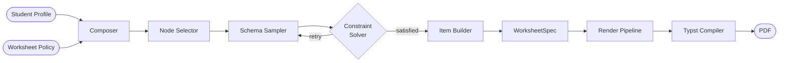

**Composer** reads the policy's `Band` definitions (e.g. 70% target node, 20% prerequisite review, 10% non-routine) and calls the plugin's `execute_schema` for each required item, retrying if constraints are not satisfied.

### 4.5 Render Pipeline

The render pipeline is a two-step process:

1. **Serialise** the `WorksheetSpec` to a JSON data file.
2. **Invoke** the Typst compiler with the relevant template and the JSON data file.

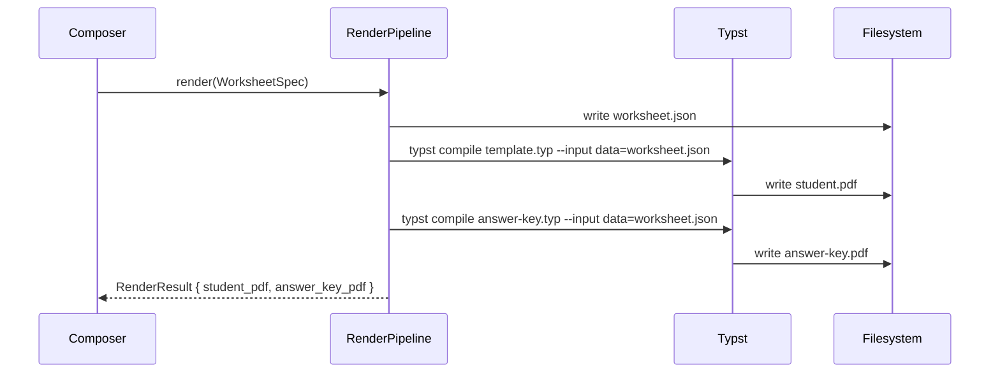

Typst templates read the structured data via `sys.inputs` and lay out items, headings, working-space boxes, and visuals accordingly.

---

## 5. Worksheet Customisation

Users (via CLI or web UI) control three layers of customisation:

### 5.1 Student Profile

Captures where the student currently is and personal details printed on the sheet.

```yaml
# profiles/alice.yaml
name: Alice Tan
discipline: math-singapore
current_node: p3-fractions-unit-fractions
mastery:
  p3-fractions-equivalent: proficient
  p3-fractions-comparing: learning
customisations:
  header:
    school: Rosyth School
    class: 3 Integrity
    date: auto          # auto-filled at generation time
  layout:
    font_size: 13       # pt; default 12
    working_space: large  # small | medium | large
```

### 5.2 Worksheet Policy

Defines what is on the worksheet — the mix of topics, item count, and format.

```yaml
# policies/p3-fractions-standard.yaml
discipline: math-singapore
target_node: p3-fractions-unit-fractions
composition:
  - source: target_node
    weight: 0.70
    item_types: [drill, short-answer]
  - source: prerequisites
    weight: 0.20
    item_types: [drill]
  - source: non-routine
    weight: 0.10
    item_types: [word-problem]
item_count: 30
include_answer_key: true
include_workings: false
```

### 5.3 Custom Sections

Users can inject fixed content blocks anywhere in the generated worksheet — a teacher's introduction, a worked example, a custom diagram, or a hand-written question.

```yaml
# custom_sections field in WorksheetPolicy
custom_sections:
  - position: before_item 5
    type: worked_example
    content: |
      **Worked Example**
      What fraction of the shape is shaded?
      [diagram: fraction-bar-thirds-one-shaded]
  - position: after_item 20
    type: free_text
    content: "--- Short Break! Great work so far. ---"
```

These sections are passed verbatim into the Typst template as literal blocks and do not go through the schema engine.

---

## 6. Discipline Plugins

Each plugin is an independent Rust crate that knows about its own domain.

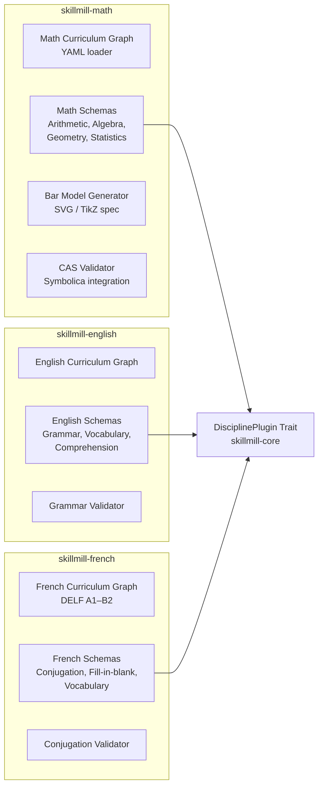

### Plugin responsibilities

| Responsibility | Owner |
|---|---|
| Curriculum graph YAML | Plugin |
| Schema definitions & execution | Plugin |
| Answer validation logic | Plugin |
| Visual spec generation (bar models, diagrams) | Plugin |
| Typst templates (discipline-specific layout) | Plugin |
| Variable sampling, constraint retry loop | Core |
| Worksheet composition (band mixing) | Core |
| Typst invocation & PDF output | Core |
| Student profile & customisation | Core |

---

## 7. CLI Tool: `skillmill-cli`

### 7.1 Command Overview

```
skillmill init profile          # interactive wizard → writes a profile YAML
skillmill init policy           # interactive wizard → writes a policy YAML

skillmill generate              # generate a worksheet PDF
skillmill preview               # render sample items to terminal (no PDF)

skillmill list disciplines      # show all registered plugins
skillmill list nodes            # browse curriculum nodes for a discipline

skillmill validate              # run CI validation suite on schemas
```

---

### 7.2 `skillmill init` — Interactive Configuration Wizards

`init` is the primary way new users create YAML configuration files. It asks a series of questions, shows contextual help, applies sensible defaults, and writes a ready-to-use file. Users with existing files can re-run `init` to update them.

#### 7.2.1 `skillmill init profile`

Creates or updates a student profile YAML.

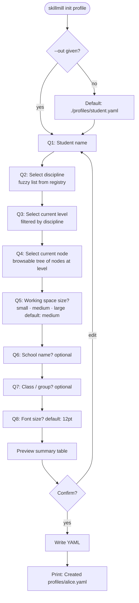

**Example session:**

```
$ skillmill init profile

SkillMill — Student Profile Setup
──────────────────────────────────

Student name: Alice Tan

Discipline:
  1. math-singapore  — Singapore MOE Mathematics (P1–O Level)
  2. english-cambridge — Cambridge English Grammar & Vocabulary
  3. french-delf      — French DELF (A1–B2)
Select [1]: 1

Level:
  1. Primary 1   2. Primary 2   3. Primary 3 ◀ suggested
  4. Primary 4   5. Primary 5   6. Primary 6
  7. Secondary 1  ...
Select [3]: 3

Current topic (Primary 3 — scroll to browse):
  ▸ Number & Algebra
      Whole Numbers
        [ ] p3-numbers-place-value
        [ ] p3-numbers-addition-subtraction
      Fractions
        [✓] p3-fractions-unit-fractions       ← select current
        [ ] p3-fractions-equivalent
        [ ] p3-fractions-comparing
  ▸ Measurement & Geometry
  ...
Select node [p3-fractions-unit-fractions]: ↵

Working space per question:  small / [medium] / large: ↵

School name (optional): Rosyth School
Class / group (optional): 3 Integrity
Font size pt [12]: ↵

──────────────────────────────────
  Name:        Alice Tan
  Discipline:  math-singapore
  Level:       Primary 3
  Node:        p3-fractions-unit-fractions
  Working:     medium
  School:      Rosyth School
  Class:       3 Integrity
  Font size:   12 pt
──────────────────────────────────
Write to profiles/alice.yaml? [Y/n]: ↵

✓ Created profiles/alice.yaml
  Next: skillmill init policy --profile profiles/alice.yaml
```

**Generated file:**

```yaml
# profiles/alice.yaml
# Generated by: skillmill init profile  (2026-03-03)
name: Alice Tan
discipline: math-singapore
current_node: p3-fractions-unit-fractions
mastery: {}
customisations:
  header:
    school: Rosyth School
    class: 3 Integrity
    date: auto
  layout:
    font_size: 12
    working_space: medium
```

---

#### 7.2.2 `skillmill init policy`

Creates or updates a worksheet policy YAML. If `--profile` is supplied, the wizard pre-fills the discipline and target node from the profile.

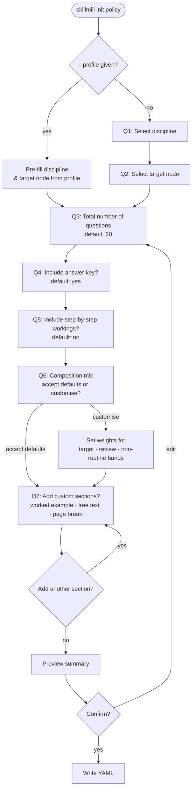

**Default composition by discipline:**

| Discipline | Target skill | Prerequisite review | Non-routine |
|---|---|---|---|
| math-singapore | 70% | 20% | 10% |
| english-cambridge | 60% | 25% | 15% |
| french-delf | 65% | 25% | 10% |

Defaults are provided by each `DisciplinePlugin` and can always be overridden in the wizard.

**Example session (with --profile):**

```
$ skillmill init policy --profile profiles/alice.yaml

SkillMill — Worksheet Policy Setup
────────────────────────────────────
Profile loaded: Alice Tan · math-singapore · p3-fractions-unit-fractions

Total questions [20]: 30
Include answer key? [Y/n]: ↵
Include step-by-step workings? [y/N]: ↵

Composition mix — defaults for math-singapore:
  70%  Target skill   (drill, short-answer)
  20%  Prerequisite review  (drill)
  10%  Non-routine word problems
Customise? [y/N]: ↵

Add a custom section?
  1. Worked example
  2. Free text / separator
  3. Page break
  4. No — finish
Select [4]: 1

  Insert before which question? [1]: 5
  Content (end with a blank line):
  Worked Example: What is 1/4 of 20?  Draw a bar model.
  [blank line]

Add another section? [y/N]: ↵

────────────────────────────────────
  Discipline:   math-singapore
  Target node:  p3-fractions-unit-fractions
  Questions:    30
  Answer key:   yes       Workings: no
  Composition:  70 / 20 / 10
  Custom sections: 1 (worked example before Q5)
────────────────────────────────────
Write to policies/p3-fractions-standard.yaml? [Y/n]: ↵

✓ Created policies/p3-fractions-standard.yaml
  Next: skillmill generate \
    --profile profiles/alice.yaml \
    --policy policies/p3-fractions-standard.yaml
```

**Generated file:**

```yaml
# policies/p3-fractions-standard.yaml
# Generated by: skillmill init policy  (2026-03-03)
discipline: math-singapore
target_node: p3-fractions-unit-fractions
composition:
  - source: target_node
    weight: 0.70
    item_types: [drill, short-answer]
  - source: prerequisites
    weight: 0.20
    item_types: [drill]
  - source: non-routine
    weight: 0.10
    item_types: [word-problem]
item_count: 30
include_answer_key: true
include_workings: false
custom_sections:
  - position: before_item 5
    type: worked_example
    content: |
      Worked Example: What is 1/4 of 20?  Draw a bar model.
```

---

### 7.3 `skillmill generate`

Generates PDFs from existing profile and policy files.

```
skillmill generate
    --policy <file>             # worksheet policy YAML
    --profile <file>            # student profile YAML (optional)
    --out <dir>                 # output directory (default: ./out)
    --no-answer-key             # suppress answer key PDF
    --seed <n>                  # fix RNG seed for reproducible output
```

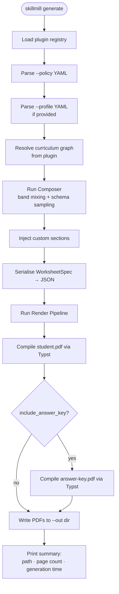

**Output:**

```
$ skillmill generate --profile profiles/alice.yaml --policy policies/p3-fractions-standard.yaml

✓ Generated in 1.4s
  out/alice-p3-fractions-unit-fractions-student.pdf   (4 pages)
  out/alice-p3-fractions-unit-fractions-answer-key.pdf (4 pages)
```

---

### 7.4 `skillmill preview`

Renders sample items to the terminal (no PDF) for quick schema inspection.

```
skillmill preview
    --discipline <id>
    --node <node-id>
    --count <n>                 # default: 5
    --seed <n>
```

Output is plain text — question, answer, and (if available) working — useful during schema development.

---

### 7.5 `skillmill list`

```
skillmill list disciplines
    # prints all registered plugins with id, name, node count

skillmill list nodes
    --discipline <id>
    --level <level>             # e.g. p3, secondary-1, delf-a2
    --search <query>            # fuzzy search node labels
```

---

### 7.6 `skillmill validate`

```
skillmill validate
    --discipline <id>
    --schema <schema-id>        # validate a single schema (omit for all)
    --count <n>                 # samples per schema (default: 1000)
```

Calls `DisciplinePlugin::validate_answer` on every generated sample and reports any failures. Used in CI.

---

## 8. Web Server: `skillmill-server`

### 8.1 Architecture

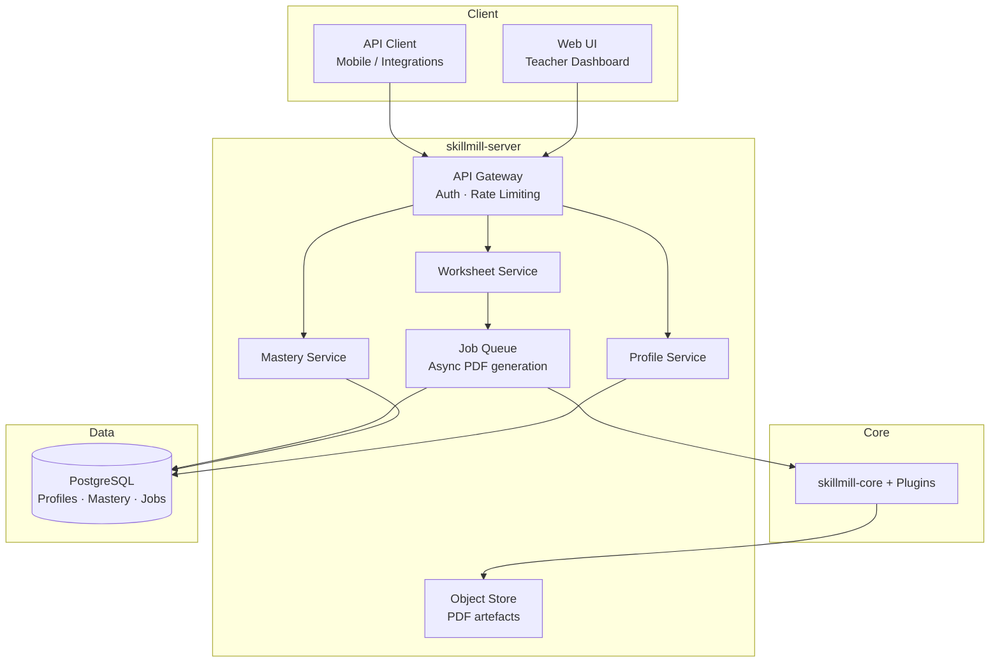

### 8.2 Key API Endpoints

```
POST /worksheets/generate
    Body: { discipline, policy, profile_id?, customisations? }
    Returns: { job_id }

GET  /worksheets/jobs/:id
    Returns: { status: pending|processing|done|error, pdf_url?, error? }

GET  /worksheets/:id/student.pdf
GET  /worksheets/:id/answer-key.pdf

POST /profiles
    Body: StudentProfile (JSON)
    Returns: { profile_id }

GET  /profiles/:id
PUT  /profiles/:id

GET  /disciplines
    Returns: list of registered discipline plugins

GET  /disciplines/:id/nodes
    Query: ?level=p3
    Returns: curriculum node list

GET  /disciplines/:id/nodes/:node_id/preview
    Query: ?count=5
    Returns: sample generated items (JSON, not PDF)
```

### 8.3 Worksheet Generation Job Flow

PDF generation is handled asynchronously to keep API responses fast.

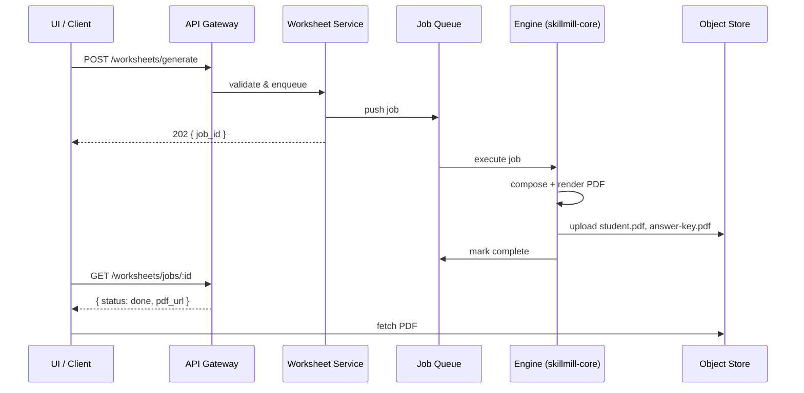

---

## 9. Typst Templates

### 9.1 Template Hierarchy

```
templates/
├── base/
│   ├── worksheet.typ       # shared layout: header, footer, item grid
│   ├── answer-key.typ      # answer key variant
│   └── components/
│       ├── header.typ
│       ├── item.typ        # renders a single GeneratedItem
│       ├── worked-example.typ
│       └── custom-section.typ
└── disciplines/
    ├── math/
    │   ├── worksheet.typ   # imports base, overrides item renderer
    │   ├── bar-model.typ   # bar model drawing functions
    │   └── geometry.typ    # shape drawing functions
    ├── english/
    │   └── worksheet.typ
    └── french/
        ├── worksheet.typ
        └── conjugation-table.typ
```

### 9.2 Data Contract (JSON → Typst)

The engine writes `worksheet.json` which the Typst template reads via `sys.inputs`. Abbreviated schema:

```json
{
  "meta": {
    "student_name": "Alice Tan",
    "school": "Rosyth School",
    "class": "3 Integrity",
    "date": "2026-03-03",
    "discipline": "math-singapore",
    "generated_at": "2026-03-03T09:00:00Z"
  },
  "layout": {
    "font_size": 13,
    "working_space": "large"
  },
  "sections": [
    {
      "type": "custom",
      "content": "Worked Example ..."
    },
    {
      "type": "item",
      "number": 1,
      "node_id": "p3-fractions-unit-fractions",
      "question": "What is \\frac{1}{3} of 18?",
      "answer": "6",
      "working": null,
      "visuals": []
    },
    {
      "type": "item",
      "number": 2,
      "node_id": "p3-fractions-unit-fractions",
      "question": "Draw a bar model to show \\frac{2}{5} of 20 apples.",
      "answer": "8",
      "working": "20 ÷ 5 = 4 → 4 × 2 = 8",
      "visuals": [
        {
          "kind": "bar-model",
          "total_units": 5,
          "shaded_units": 2,
          "total_value": 20
        }
      ]
    }
  ]
}
```

---

## 10. CI/CD & Quality Guarantees

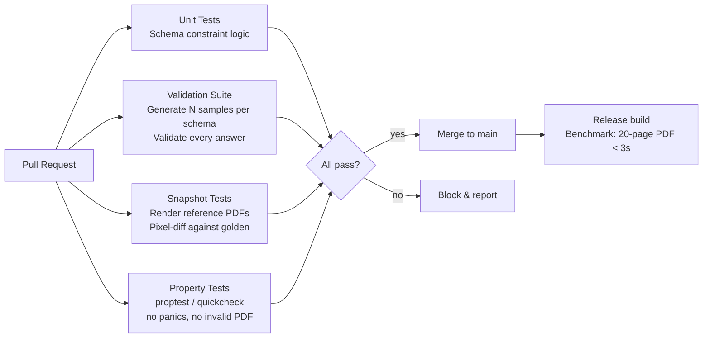

### Test categories

| Category | Tool | What it catches |
|---|---|---|
| Unit | Rust `#[test]` | Schema variable sampling, constraint logic |
| Validation | Custom harness | Wrong answers in generated items |
| Property | `proptest` | Panics, crashes, infinite loops in schemas |
| Snapshot | `insta` + Typst render | Visual regressions in PDF layout |
| Benchmark | `criterion` | Performance regressions (target: < 3s per worksheet) |

Zero tolerance policy: any CI failure blocks merge. The `validate_answer` method on each plugin is the authoritative source of truth for correctness; the Symbolica CAS backend is used for algebraic disciplines.

---

## 11. Phased Delivery

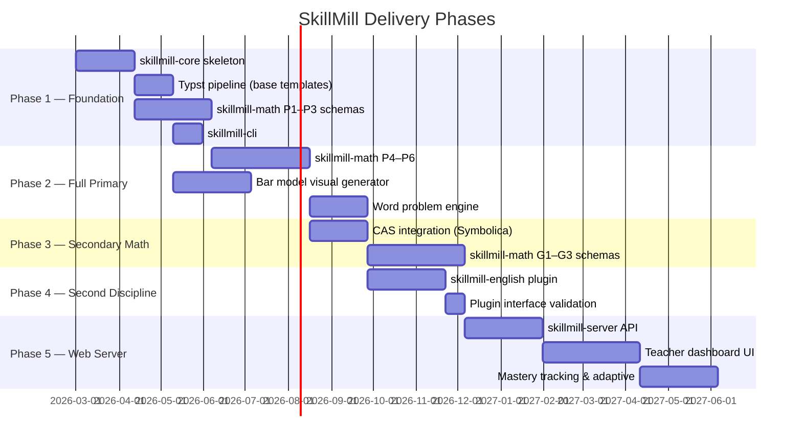
