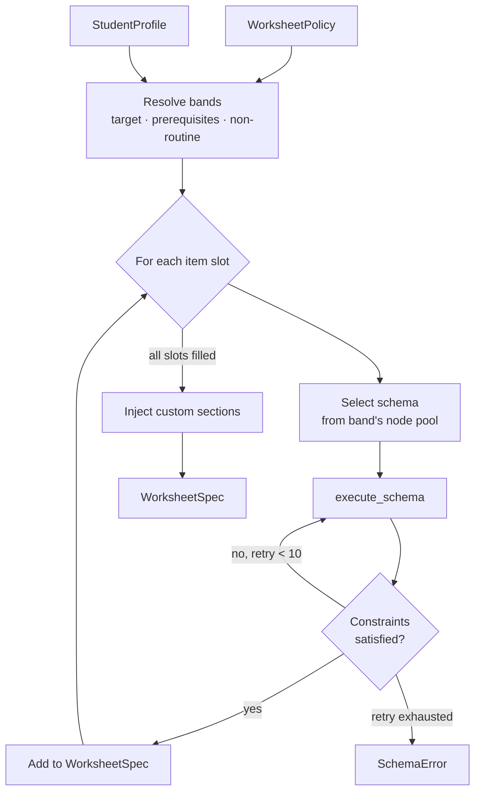

# SkillMill — Development Roadmap

**Document status:** Draft v0.1
**Last updated:** 2026-03-03

---

## Overview

This roadmap is structured in two parts:

1. **MVP** — a detailed, milestone-by-milestone plan to reach a working end-to-end system: a CLI that generates a real, typeset PDF worksheet for Singapore Math Primary 1–3 arithmetic.
2. **Post-MVP phases** — the subsequent phases that expand curriculum coverage, add disciplines, and build the web product.

The MVP proves the entire pipeline: dev environment → Rust workspace → plugin trait → schema engine → Typst rendering → PDF output.

---

## Part 1: MVP

**Goal:** `skillmill generate` produces a correctly typeset, mathematically verified PDF worksheet and answer key for Singapore Math P1–P3 arithmetic drills, driven by YAML profile and policy files created with `skillmill init`.

**Out of scope for MVP:** bar models, word problems, CAS, secondary math, web server, non-math disciplines, mastery tracking.

---

### Milestone 0 — Dev Environment

Establish a reproducible development environment using Nix flakes, following the same patterns as the forgemux project.

#### 0.1 Nix flake

Create `flake.nix` at the repo root:

```nix
{
  description = "skillmill - constraint-driven worksheet factory";

  inputs = {
    nixpkgs.url     = "github:NixOS/nixpkgs/nixpkgs-unstable";
    rust-overlay    = {
      url    = "github:oxalica/rust-overlay";
      inputs.nixpkgs.follows = "nixpkgs";
    };
    flake-utils.url = "github:numtide/flake-utils";
  };

  outputs = { self, nixpkgs, rust-overlay, flake-utils }:
    flake-utils.lib.eachDefaultSystem (system:
      let
        overlays     = [ (import rust-overlay) ];
        pkgs         = import nixpkgs { inherit system overlays; };
        rustToolchain = pkgs.rust-bin.stable.latest.default.override {
          extensions = [ "clippy" "rustfmt" "rust-src" ];
        };
      in {
        devShells.default = pkgs.mkShell {
          buildInputs = [
            rustToolchain

            # Rendering
            pkgs.typst

            # Cargo dev tools
            pkgs.cargo-nextest   # fast test runner
            pkgs.cargo-insta     # snapshot testing
            pkgs.cargo-deny      # dependency auditing
            pkgs.cargo-llvm-cov  # code coverage

            # Utilities
            pkgs.git
            pkgs.jq              # inspect generated JSON worksheet specs
          ];

          shellHook = ''
            if git rev-parse --git-dir > /dev/null 2>&1; then
              git config core.hooksPath .githooks
            fi
            echo "SkillMill dev shell ready. Run 'cargo build' to get started."
          '';
        };
      }
    );
}
```

#### 0.2 Cargo workspace

Create `Cargo.toml` at the repo root:

```toml
[workspace]
members = [
  "crates/skillmill-core",
  "crates/skillmill-cli",
  "plugins/skillmill-math",
]
resolver = "2"

[workspace.package]
edition     = "2024"
license     = "MIT"
repository  = "https://github.com/jonochang/skillmill"

[workspace.dependencies]
anyhow          = "1"
clap            = { version = "4", features = ["derive"] }
serde           = { version = "1", features = ["derive"] }
serde_json      = "1"
thiserror       = "2"
rand            = "0.9"
indexmap        = { version = "2", features = ["serde"] }
schemars        = "0.8"
tracing         = "0.1"
tracing-subscriber = { version = "0.3", features = ["env-filter"] }
# Testing
insta           = { version = "1", features = ["yaml"] }
proptest        = "1"
```

#### 0.3 Git hooks

Create `.githooks/pre-commit`:

```sh
#!/usr/bin/env sh
set -e
cargo fmt --check
cargo clippy --all-targets -- -D warnings
```

#### Milestone 0 checklist

- [ ] `flake.nix` committed; `nix develop` enters the shell without errors
- [ ] `typst --version` available inside the shell
- [ ] Cargo workspace builds with `cargo build`
- [ ] `cargo nextest run` passes (zero tests, zero failures)
- [ ] `cargo fmt --check` and `cargo clippy` pass clean
- [ ] `flake.lock` committed

---

### Milestone 1 — Core Skeleton (`skillmill-core`)

Define the data types, plugin trait, and stubs for the composer and render pipeline. No real logic yet — the goal is a compiling, well-typed foundation.

#### 1.1 Crate structure

```
crates/skillmill-core/
└── src/
    ├── lib.rs
    ├── curriculum.rs   # CurriculumGraph, Node, NodeId, Level
    ├── schema.rs       # Schema, Variable, Constraint, GeneratedItem
    ├── profile.rs      # StudentProfile, WorksheetCustomisation
    ├── policy.rs       # WorksheetPolicy, Band, BandSource
    ├── compose.rs      # Composer (stub)
    ├── render.rs       # RenderPipeline (stub)
    └── plugin.rs       # DisciplinePlugin trait, PluginRegistry
```

#### 1.2 Plugin trait (the critical interface)

```rust
// crates/skillmill-core/src/plugin.rs

pub trait DisciplinePlugin: Send + Sync {
    fn id(&self)   -> &'static str;
    fn name(&self) -> &'static str;

    fn curriculum(&self) -> &CurriculumGraph;

    fn default_composition(&self) -> Vec<Band>;

    fn execute_schema(
        &self,
        schema_id: &SchemaId,
        rng:       &mut dyn rand::RngCore,
        difficulty: &DifficultyAxes,
    ) -> Result<GeneratedItem, SchemaError>;

    fn validate_answer(&self, item: &GeneratedItem) -> ValidationResult;

    fn template_dir(&self) -> &std::path::Path;
}

pub struct PluginRegistry {
    plugins: indexmap::IndexMap<String, Box<dyn DisciplinePlugin>>,
}

impl PluginRegistry {
    pub fn new() -> Self { ... }
    pub fn register(&mut self, plugin: Box<dyn DisciplinePlugin>) { ... }
    pub fn get(&self, id: &str) -> Option<&dyn DisciplinePlugin> { ... }
    pub fn ids(&self) -> impl Iterator<Item = &str> { ... }
}
```

#### 1.3 YAML loading

`CurriculumGraph`, `WorksheetPolicy`, and `StudentProfile` all deserialise from YAML using `serde` + `serde_yaml`. Each has a `load_from_file(path)` constructor. Invalid files return a descriptive `anyhow::Error`.

#### Milestone 1 checklist

- [ ] All types compile with no warnings
- [ ] `DisciplinePlugin` trait is object-safe (`Box<dyn DisciplinePlugin>` works)
- [ ] `PluginRegistry` registers and retrieves plugins by id
- [ ] Round-trip test: serialise a `WorksheetPolicy` to YAML and deserialise it back
- [ ] Round-trip test: same for `StudentProfile`

---

### Milestone 2 — Math Plugin: P1–P3 Arithmetic (`skillmill-math`)

Implement the first discipline plugin. Scope is restricted to P1–P3 whole-number arithmetic — addition, subtraction, multiplication, division — with no word problems or visuals.

#### 2.1 Curriculum graph

`plugins/skillmill-math/curricula/p1-p3.yaml` — hand-authored YAML covering:

| Node ID | Label | Level | Prerequisite |
|---|---|---|---|
| `p1-numbers-count-to-100` | Count and write to 100 | P1 | — |
| `p1-add-sub-within-10` | Add & subtract within 10 | P1 | `p1-numbers-count-to-100` |
| `p1-add-sub-within-20` | Add & subtract within 20 | P1 | `p1-add-sub-within-10` |
| `p2-add-sub-within-100` | Add & subtract within 100 | P2 | `p1-add-sub-within-20` |
| `p2-multiply-2-3-4-5-10` | Multiply (2, 3, 4, 5, 10 times tables) | P2 | `p2-add-sub-within-100` |
| `p2-divide-2-3-4-5-10` | Divide (2, 3, 4, 5, 10 times tables) | P2 | `p2-multiply-2-3-4-5-10` |
| `p3-add-sub-within-10000` | Add & subtract within 10,000 | P3 | `p2-add-sub-within-100` |
| `p3-multiply-6-7-8-9` | Multiply (6, 7, 8, 9 times tables) | P3 | `p2-multiply-2-3-4-5-10` |
| `p3-divide-6-7-8-9` | Divide (6, 7, 8, 9 times tables) | P3 | `p2-divide-2-3-4-5-10` |

#### 2.2 Schemas

Each node has at least two schemas: a **horizontal drill** (e.g., `___ + ___ = ___`) and a **vertical drill** (column layout). Constraints ensure:

- Results are always positive
- No division remainders (exact division only at this level)
- Addends and minuends are within the node's stated number range
- Subtrahend is always ≤ minuend

Example schema (Rust pseudo-code):

```rust
// "p1-add-within-10-horizontal"
// Variables: a ∈ [1,9],  b ∈ [1, 10-a]
// Answer: a + b
// Question template: "{a} + {b} = ___"

fn execute(&self, rng, difficulty) -> GeneratedItem {
    let a: u32 = rng.gen_range(1..=9);
    let b: u32 = rng.gen_range(1..=(10 - a));  // constraint: sum ≤ 10
    GeneratedItem {
        question: format!("{} + {} = ___", a, b),
        answer:   format!("{}", a + b),
        working:  None,
        visuals:  vec![],
    }
}
```

#### 2.3 Answer validation

`validate_answer` re-parses the question and independently computes the answer using integer arithmetic. Any mismatch is a CI failure.

#### Milestone 2 checklist

- [ ] `MathPlugin` implements `DisciplinePlugin` and compiles
- [ ] All 9 P1–P3 nodes are in the curriculum YAML
- [ ] Every node has ≥ 2 schemas (horizontal drill, vertical drill)
- [ ] Validation suite: 1,000 samples per schema, 0 failures
- [ ] Property test: no schema panics or produces invalid output over 10,000 iterations
- [ ] `skillmill list nodes --discipline math-singapore --level p1` shows correct output

---

### Milestone 3 — Composer

Implement the worksheet composition engine in `skillmill-core::compose`. Given a `WorksheetPolicy`, a `StudentProfile`, and the plugin, it produces a `WorksheetSpec`.

#### 3.1 Composition logic



#### 3.2 Band resolution

| Band source | How nodes are selected |
|---|---|
| `target_node` | The node named in the policy |
| `prerequisites` | Direct prerequisites of the target node (from curriculum graph) |
| `non-routine` | Currently: same as target but with a `varied` difficulty axis flag |

#### Milestone 3 checklist

- [ ] `Composer::compose` produces a `WorksheetSpec` with the correct item count
- [ ] Band weights are respected (within ±1 item rounding)
- [ ] Custom sections appear at the correct positions
- [ ] Integration test: compose a 20-item P3 worksheet, assert item count and band distribution

---

### Milestone 4 — Typst Rendering Pipeline

Connect the `WorksheetSpec` to the Typst compiler and produce PDFs.

#### 4.1 Base Typst templates

`templates/base/worksheet.typ` — renders a student worksheet:
- Header: student name, school, class, date
- Items numbered and laid out in a two-column grid
- Working space box (height driven by `layout.working_space`)
- Custom sections injected verbatim at their declared positions
- Footer: page number

`templates/base/answer-key.typ` — same layout, answers printed inline, workings section if `include_workings: true`.

`templates/disciplines/math/worksheet.typ` — imports base; overrides item renderer for math notation (fractions, vertical column layout for drill items).

#### 4.2 JSON data contract

`RenderPipeline` serialises `WorksheetSpec` to `worksheet.json`, invokes:

```sh
typst compile templates/disciplines/math/worksheet.typ \
    --input data=./worksheet.json \
    --output student.pdf
```

Both PDFs are compiled in parallel using `tokio::task::spawn_blocking`.

#### 4.3 Performance target

A 20-item worksheet (student + answer key) must compile in under 3 seconds on a developer laptop. Benchmark with `criterion`.

#### Milestone 4 checklist

- [ ] `RenderPipeline::render` produces a valid (non-zero byte) PDF
- [ ] PDF opens without errors in a PDF viewer
- [ ] Header fields (name, school, date) match the input profile
- [ ] Item numbers are sequential and match `WorksheetSpec.items`
- [ ] Custom sections appear at correct positions
- [ ] Answer key shows correct answers for every item
- [ ] Snapshot test: render a reference worksheet; pixel-diff against golden PDF
- [ ] Benchmark: 20-item worksheet compiles in < 3s

---

### Milestone 5 — CLI: `init` Wizards & `generate`

Implement the three MVP commands: `skillmill init profile`, `skillmill init policy`, and `skillmill generate`.

#### 5.1 Crate structure

```
crates/skillmill-cli/
└── src/
    ├── main.rs
    ├── commands/
    │   ├── mod.rs
    │   ├── init/
    │   │   ├── profile.rs   # interactive profile wizard
    │   │   └── policy.rs    # interactive policy wizard
    │   ├── generate.rs
    │   ├── preview.rs
    │   ├── list.rs
    │   └── validate.rs
    └── ui/
        ├── prompt.rs        # text input, select, confirm helpers
        └── tree.rs          # browsable curriculum node tree
```

Use `clap` (derive API) for argument parsing. Use `dialoguer` for interactive prompts (select lists, text input, confirmation).

#### 5.2 `skillmill init profile` flow

1. Prompt: student name (text input, required)
2. Prompt: discipline (select from `registry.ids()`)
3. Prompt: level (select, filtered by discipline)
4. Prompt: current node (browsable tree grouped by level → strand → node)
5. Prompt: working space — `small` / `medium` (default) / `large`
6. Prompt: school name (optional, blank to skip)
7. Prompt: class (optional, blank to skip)
8. Prompt: font size pt (default: 12)
9. Display summary table; prompt confirm or restart
10. Write YAML; print path and next-step hint

#### 5.3 `skillmill init policy` flow

1. If `--profile` given: load profile, pre-fill discipline and target node (skip prompts 2–3)
2. Prompt: discipline (if not pre-filled)
3. Prompt: target node (searchable select)
4. Prompt: total question count (default: 20)
5. Prompt: include answer key? (default: yes)
6. Prompt: include workings? (default: no)
7. Prompt: customise composition mix? (default: no → use plugin defaults)
   - If yes: prompt weights for target / review / non-routine bands
8. Prompt: add custom sections? (loop: worked-example / free-text / page-break / done)
9. Summary + confirm
10. Write YAML; print path and next-step hint

#### 5.4 `skillmill generate` flags

```
skillmill generate
    --policy  <file>       required
    --profile <file>       optional
    --out     <dir>        default: ./out
    --no-answer-key
    --seed    <n>          fix RNG for reproducibility
```

Output on success:

```
✓ Generated in 1.4s
  out/alice-p3-add-sub-within-10000-student.pdf    (4 pages)
  out/alice-p3-add-sub-within-10000-answer-key.pdf (4 pages)
```

#### 5.5 YAML defaults written by wizards

Both wizards add a `# Generated by:` comment header and inline comments on non-obvious fields (e.g., `date: auto  # filled at generation time`), so users who open the file can understand and hand-edit it.

#### Milestone 5 checklist

- [ ] `skillmill init profile` produces a valid, loadable YAML file
- [ ] `skillmill init policy` produces a valid, loadable YAML file
- [ ] `skillmill init policy --profile <file>` pre-fills discipline and node correctly
- [ ] `skillmill generate` ends-to-end: reads YAMLs, composes, renders, writes PDFs
- [ ] `--seed` produces identical PDFs on repeated runs
- [ ] All prompts have working defaults (Enter through every prompt produces a valid output)
- [ ] Error messages are human-readable (bad YAML path, unknown node ID, etc.)

---

### Milestone 6 — CI/CD Pipeline

Automate quality gates so every commit is verified before merge.

#### 6.1 GitHub Actions workflow

```yaml
# .github/workflows/ci.yml
on: [push, pull_request]

jobs:
  check:
    runs-on: ubuntu-latest
    steps:
      - uses: nixbuild/nix-quick-install-action@v28
      - run: nix develop --command cargo fmt --check
      - run: nix develop --command cargo clippy --all-targets -- -D warnings
      - run: nix develop --command cargo nextest run
      - run: nix develop --command cargo nextest run --test-threads=1  # snapshot tests
      - run: nix develop --command cargo deny check
```

#### 6.2 Validation job

Runs `skillmill validate --discipline math-singapore --count 1000` against every schema and fails on any wrong answer. Added as a separate CI step after the unit tests.

#### 6.3 Snapshot test workflow

`cargo insta review` is run locally by the developer when golden snapshots change intentionally. CI runs `cargo insta test --check` (fails if snapshots don't match committed goldens).

#### Milestone 6 checklist

- [ ] CI passes on every push to `master`
- [ ] `cargo deny check` passes (no unmaintained or forbidden licences)
- [ ] Snapshot goldens are committed; CI fails if they drift
- [ ] Validation job runs 1,000 samples per P1–P3 schema with 0 failures

---

### MVP Definition of Done

The MVP is complete when all of the following are true:

1. `nix develop` enters the dev shell without errors on a clean checkout
2. `cargo nextest run` passes (all unit, integration, and snapshot tests)
3. CI is green on `master`
4. `skillmill init profile` → `skillmill init policy` → `skillmill generate` produces two PDFs
5. Both PDFs open correctly in a PDF viewer
6. Answer key contains 0 mathematical errors across a manual spot-check of 50 items
7. 20-item worksheet generation completes in under 3 seconds
8. Validation suite: 1,000 samples per schema, 0 failures

---

## Part 2: Post-MVP Phases

The phases below follow Phase 1 (MVP). Each phase builds on the last and the architecture remains stable — new curriculum coverage and disciplines are additive.

---

### Phase 2 — Full Primary Mathematics & Bar Modelling (P4–P6)

**Goal:** Complete the Singapore primary math curriculum and introduce the first visual item type.

- Expand `skillmill-math` curriculum graph to P4–P6: fractions, decimals, percentages, ratio, measurement, geometry, statistics
- Implement word-problem schemas with a semantic item spec (knowns/unknowns structure)
- Bar model visual generator: produces a `BarModelSpec` JSON that the Typst template renders as a proportional diagram
- Geometry shape generator: circles, rectangles, triangles with labelled dimensions
- Typst math template updated to handle fraction notation, tables, and embedded diagrams

---

### Phase 3 — Secondary Mathematics Core (G1–G3)

**Goal:** Cover the Express/Normal (Academic) lower secondary syllabus.

- Expand curriculum graph to G1–G3: integers, linear equations, simultaneous equations, basic geometry proofs, statistics
- Integrate Symbolica CAS for algebraic answer validation (replaces integer arithmetic checker for this level)
- Multi-step working generation: engine produces a worked-solution tree, Typst renders it as numbered steps
- Typst template updated for algebraic notation (aligned equations, fraction bars)

---

### Phase 4 — Advanced Secondary (O-Level / Additional Mathematics)

**Goal:** Cover the full SEAB O-Level and Additional Mathematics syllabi.

- Expand curriculum to O-Level: quadratics, coordinate geometry, trigonometry, functions, vectors, probability
- Add Math: calculus (differentiation and integration), binomial expansion, complex numbers (partial)
- Automated marking scheme generation: the engine outputs a mark-per-step answer key matching SEAB format
- Typst template updated to match official O-Level exam paper formatting (fonts, spacing, question numbering)

---

### Phase 5 — Second Discipline (English or French)

**Goal:** Validate that the plugin architecture generalises to a non-mathematics discipline.

- Choose English grammar & vocabulary (Cambridge) or French DELF (A1–B2) as the pilot
- Author the curriculum graph for the chosen discipline
- Implement schemas for the primary item types: fill-in-the-blank, multiple choice, short answer, conjugation tables
- Implement a discipline-appropriate validator (grammar rule checker or conjugation verifier)
- Design and implement Typst template for prose-based worksheet layout
- Update `skillmill init` wizard to surface the new discipline
- Success criterion: the engine generates a valid, verifiable worksheet for the new discipline using the same `generate` command

---

### Phase 6 — Web Server & Teacher Dashboard

**Goal:** Deliver SkillMill as a SaaS product accessible to tutors and schools.

- `skillmill-server` REST API (see design.md §8)
- Async PDF generation job queue
- PostgreSQL schema: users, student profiles, mastery records, generated worksheet history
- Teacher dashboard UI: discipline selector, node browser, policy builder, student roster, PDF download
- Mastery tracking: record which nodes a student has completed; surface this in `init policy` recommendations
- Adaptive daily practice sets: algorithm selects a mix of target, review, and spaced-repetition nodes based on mastery history

---

### Phase 7 — Adaptive Engine & Analytics

**Goal:** Make SkillMill respond to individual student performance over time.

- Mastery model: Bayesian Knowledge Tracing or Elo-style rating per node per student
- Automatic policy generation: given a student profile and mastery state, generate a policy without manual configuration
- Teacher analytics dashboard: class-level mastery heatmaps, common error patterns, progress over time
- Export formats: CSV mastery reports, printable progress certificates

---

## Appendix: Dependency Reference

Rust crates anticipated for the full system (beyond what is in the workspace today):

| Crate | Purpose |
|---|---|
| `dialoguer` | Interactive CLI prompts (select, input, confirm) |
| `console` | Terminal styling for CLI output |
| `indicatif` | Progress bars during PDF generation |
| `serde_yaml` | YAML deserialisation for curriculum graphs and policies |
| `proptest` | Property-based testing for schema engines |
| `insta` | Snapshot testing for rendered output |
| `tokio` | Async runtime for the web server |
| `axum` | Web framework for `skillmill-server` |
| `sqlx` | PostgreSQL ORM for the web server |
| `symbolica` | CAS for algebraic answer validation (Phase 3+) |
